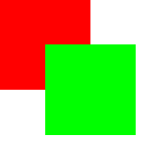
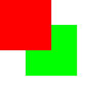
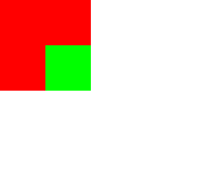
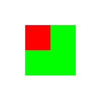
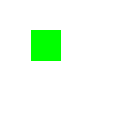
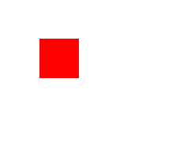
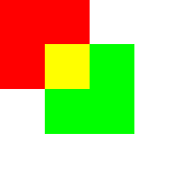
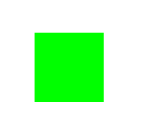
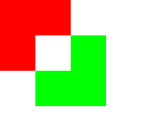

## Canvas-2

#### 1.保存绘图状态

	context.save();
	//保存的状态存放在绘图状态栈中
	//包括fillStyle和translate,scale..变化前状态

#### 2.恢复状态
	
	context.restore();
	//后进先出

#### 3.变形

    平移：
    context.translate(150,150);
    //原点移动,会影响后面所有操作原点    
	//注：该句放ctx.restore()之前不起作用

    缩放：
	context.scale(2,2);

    旋转：
    context.rotate(0.7854);
    //旋转45度(Math.PI/4);

	变换矩阵：
	context.transform(2,0,0,2,150,150);     
	//transform矩阵
	//context.transform(xScale,ySkew,xSkew,yScale,xTrans,yTrans);

#### 4.透明度
	
	context.globalAlpha = 0.5;
	//设置的是全局透明值，会叠加

#### 5.合成操作
		
	context.globalCompositeOperation = "source-over";

- 源：绘制的新图形
- 目标：可能已经绘制了图形的2D渲染上下文

1.source-over

“源”在“目标”之上

2.destination-over

"目标"在“源”之上

3.source-atop

4.destination-atop

5.source-in

6.destination-in

7.source-out

8.destination-out

9.lighter

与顺序无关，重叠部分颜色值相加，最多为255

10.copy

与顺序无关，只绘制源，覆盖掉目标

11.xor

与顺序无关，重叠部分透明

#### 6.阴影

	contex.shadowBlur = 20;
	//模糊值，20像素

	context.shadowColor = 'rgb(0,0,0)';

	context.shadowOffsetX = 20;
	//阴影X方向偏移值

	context.shadowOffsetY = 20;
	//阴影Y方向偏移值

#### 7.渐变

* 线性渐变（createLinearGradient）	 
* 放射渐变（createRadialGradient） 
  这两种方法都返回一个 __CanvasGradient__ 对象

###

	var gradient = ctx.createLinearGradient(0,0,0,canvas.height());
	//参数：渐变起点的(x,y)坐标，渐变终点的(x,y)坐标

	例：
	var gradient = ctx.createLinearGradient(0,0,0,$canvas.height());
    gradient.addColorStop(0,'rgb(0,255,0)');
    gradient.addColorStop(1,'rgb(255,0,0)');
    ctx.fillStyle = gradient;
    ctx.fillRect(0,0,$canvas.width(),$canvas.height());

#### 8.将画布导出为图像

	var dataUrl = cvs.toDataURL();
	//将当前画布图像保存成base64格式