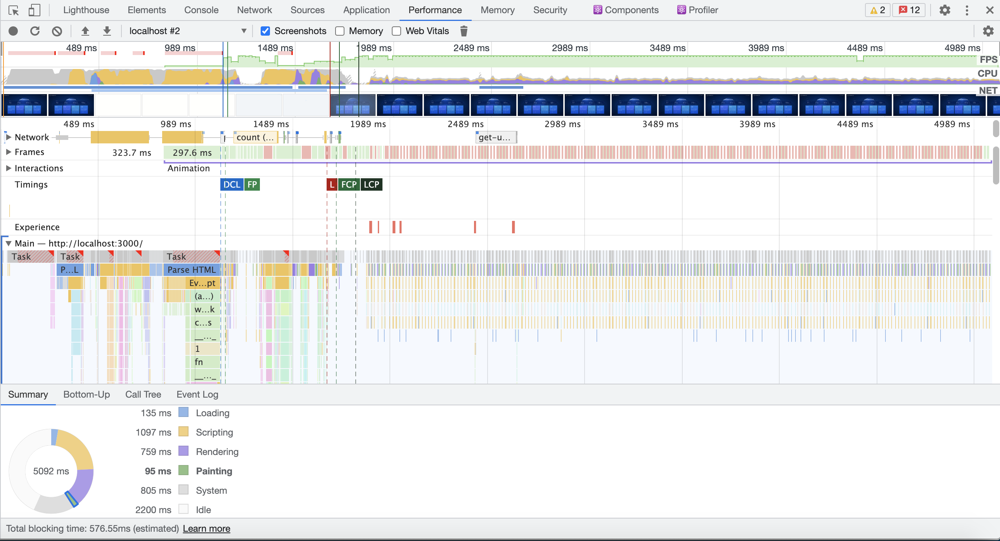
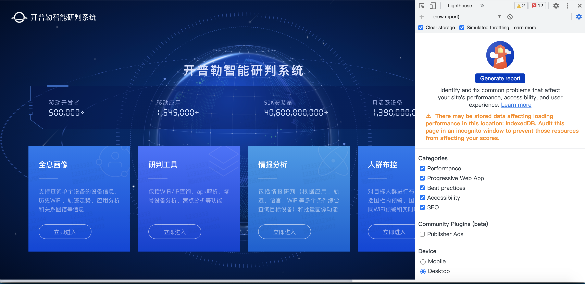
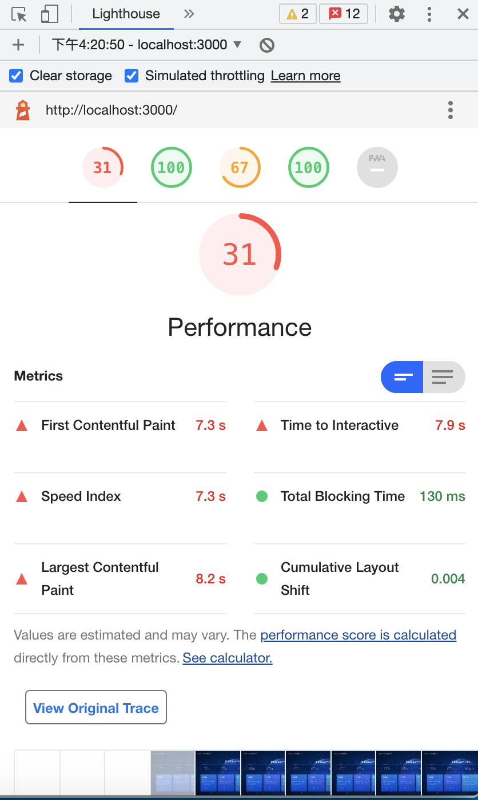

##浅谈前端优化策略

+ 文件加载更少
+ 代码执行更少

### (一) 性能检测工具

1. Chrome performance

**安装：**

​		无需安装，Chrome 浏览器开发者模式自带

**使用：**

[详细介绍](https://testerhome.com/articles/23762)

**缺点：**

指标非常详细，需要开发人员逐一甄别，要求较高。

2. [lighthouse](https://developers.google.com/web/tools/lighthouse)

**安装：**

1. 作为 Chrome 扩展程序运行，提供了一个对用户更友好的界面，方便读取报告；
2. 作为 Node 命令行工具运行，允许您将 Lighthouse 集成到持续集成系统。

**使用：**针对第一种安装方式

> 安装完成后，F12打开开发者模式，切换到“Lighthouse”面板

> 点击“Generate report”按钮，等待检查完成后会显示评分报告。

###(二)文件加载更少更小

+ 缓存、CDN
+ 图片优化，图片格式选择（简单、效率最高）
+ 静态文件优化
+ 浏览器优化
+ 文件图片压缩等常规操作

**选择合适的图片格式**

​		常见的存储的格式有JPG、GIF、PNG、SVG、Base64等。

**位图/点阵图：**

​		用像素点拼起来的图，平时我们用到的`png`、`jpg`等图片就是位图。

**矢量图：**

​		即使对画面进行倍数相当大的缩放，它也不会像位图那样会失真，常见格式`SVG`。

+ Jpg：
  + 有损压缩，压缩后体积更小
  + 有损压缩会损坏图片的质量
  + 不支持透明/半透明

+ Png：
  + 无损的，支持颜色值较丰富
  + 支持透明、半透明
  + 与jpg的有损耗压缩相比，png图片通常较大
+ SVG：
  + 无损的、矢量图
  + 与 JPEG 图像相比，尺寸更小，且可压缩性更强
  + 在放大时，不会失真，所以它非常适合用来绘制企业Logo、Icon等
  + DOM比正常的图形慢，而且如果其结点多而杂，就更慢了
+ Base64：
  + 减少网络请求。将图片转化为字符串后，图片文件会随着html元素一并加载，可以减少http请求的次数
  + 不会造成跨域请求的问题
  + 不会造成清理图片缓存的问题
  + 生成的字符串体积可能会大于原图片或url，使 css文件的大小剧增，造成代码可读性差，请求传输的数据量递增

**小结：**

+ 尽量通过较小的视觉牺牲来换取较大的性能提升；
+ 不要保存为100%品质的JPEG格式图片。因为100%并不一定是最高的品质，而是一个优化算法的极限值，所以会增加不必要的文件大小；
+ 图片大小小于2KB可将图片转换为base64；
+ 使用base64、svg或iconfont代替图片；
+ 合并图片sprite(雪碧图)。

### (三) 性能指标规范——window.performance

​		准确测量 Web 应用程序的性能特征是使 Web 应用程序更快的一个重要方面。虽然基于 JavaScript 的机制，可以为应用程序中的用户延迟测量提供全面的工具，但在许多情况下，它们无法提供完整或详细的端到端延迟图。

[W3C规范](https://www.w3.org/TR/navigation-timing-2/)

> 该规范定义了 Web 应用程序的接口，用于访问文档导航的完整时间信息。

[PerformanceTiming](https://developer.mozilla.org/zh-CN/docs/Web/API/PerformanceTiming)

+ [`PerformanceTiming.navigationStart`](https://developer.mozilla.org/zh-CN/docs/Web/API/PerformanceTiming/navigationStart) 只读

  从同一个浏览器上下文的上一个文档卸载(unload)结束时的UNIX时间戳。如果没有上一个文档，这个值会和PerformanceTiming.fetchStart相同。

+ [`PerformanceTiming.domLoading`](https://developer.mozilla.org/zh-CN/docs/Web/API/PerformanceTiming/domLoading) 只读

  返回当前网页DOM结构开始解析时（即[`Document.readyState`](https://developer.mozilla.org/zh-CN/docs/Web/API/Document/readyState)属性变为“loading”、相应的 `readystatechange (en-US)`事件触发时）的Unix毫秒时间戳。

+ [`PerformanceTiming.domInteractive`](https://developer.mozilla.org/zh-CN/docs/Web/API/PerformanceTiming/domInteractive) 只读

  返回当前网页DOM结构结束解析、开始加载内嵌资源时（即[`Document.readyState`](https://developer.mozilla.org/zh-CN/docs/Web/API/Document/readyState)属性变为“interactive”、相应的`readystatechange (en-US)`事件触发时）的Unix毫秒时间戳。

+ [`PerformanceTiming.domComplete`](https://developer.mozilla.org/zh-CN/docs/Web/API/PerformanceTiming/domComplete) 只读

  返回当前文档解析完成，即[`Document.readyState`](https://developer.mozilla.org/zh-CN/docs/Web/API/Document/readyState) 变为 `'complete'且相对应的``readystatechange (en-US)` 被触发时的Unix毫秒时间戳。

+ [`PerformanceTiming.requestStart`](https://developer.mozilla.org/zh-CN/docs/Web/API/PerformanceTiming/requestStart) 只读

  返回浏览器向服务器发出HTTP请求时（或开始读取本地缓存时）的Unix毫秒时间戳。

+ [`PerformanceTiming.responseStart`](https://developer.mozilla.org/zh-CN/docs/Web/API/PerformanceTiming/responseStart) 只读

  返回浏览器从服务器收到（或从本地缓存读取）第一个字节时的Unix毫秒时间戳。如果传输层在开始请求之后失败并且连接被重开，该属性将会被数制成新的请求的相对应的发起时间。

  ......

### (四) 代码执行更少

+ 防抖节流
+ 重绘回流
+ html、css、js
  + 减少dom
  + css避免通配符、正则选择器等

**总结：**

​	**过度优化是万恶之源**。结合业务需求，适当合理的进行优化，防止陷入内卷。

参考资料：

1.  [Chrome Performance 页面性能分析指南](https://segmentfault.com/a/1190000023272526)
2.  [前端该如何选择图片的格式](https://segmentfault.com/a/1190000022359123)
3.  [网站开发之图片格式对比与选择、图片压缩转换工具](https://www.biaodianfu.com/web-image-filetype.html)
4.  [不同图片类型以及区别](https://www.jianshu.com/p/ff63d71678d3)
5.  [渐进式jpeg(progressive jpeg)图片及其相关](https://www.zhangxinxu.com/wordpress/2013/01/progressive-jpeg-image-and-so-on/)

